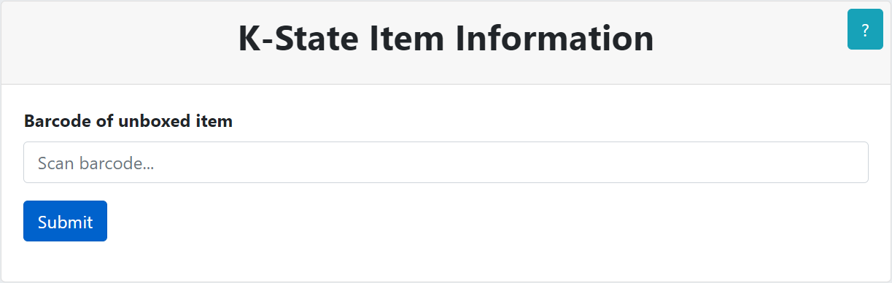
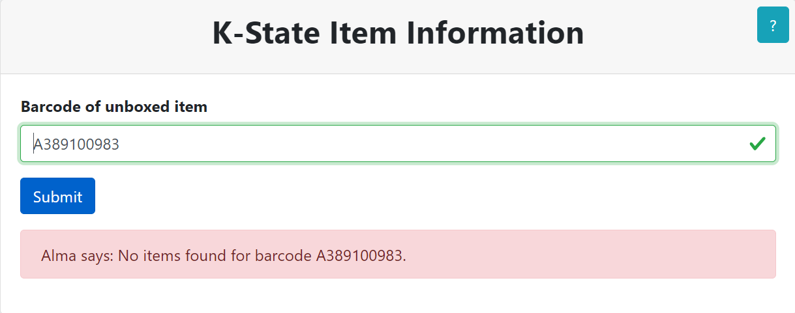
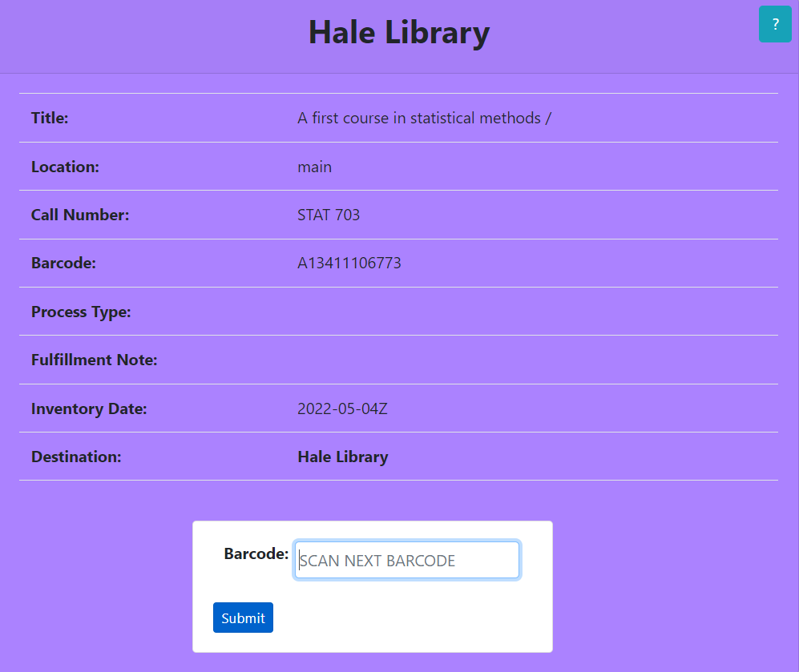
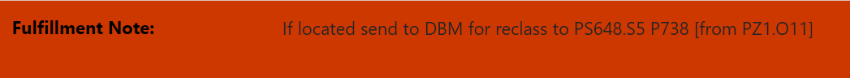

<!DOCTYPE html>
# K-State LUS Fulfillment Scan In

This application facilitates the material returns by removing Item Record Temporary Location Information. The output provides you with the physical item's **Title, Location (i.e. Permanent Location Code), Call Number, Barcode, Process Type, Fulfillment Note, Inventory Date,** and its final **Destination (i.e. Permanent Library Description)**.  The application is color coded to provide a stimulated eye response, so please review the color code table below.  After scanning your first barcode, you will be able to scan your next barcode from the results page.  If you have any questions please do not hesitate to ask Library Staff.

## Input Check the physical piece for other barocdes 

- Barcode of **Returned Item** physical item found from the outside cover, inside cover, or within the first 5 pages.  The barcode can be scanned in using the barcode scanner or typed in.  The search is not case sensitive.

## Procedure

The first form asks for you to scan a barcode.  This barcode can be scanned with the barcode scanner or by being typed in.  When you have located the barcode on the physical piece, enter that barcode into the form: 

If the barcode does not exist within the system you will get an error.  Check the physical piece for other barcodes and if they all return the following error, send the physical item to **Metadata, Preservation, and Acquisitions Database Maintenance Shelf**: 

The next form will display the physical item information.  The **Destination** will display at the top of the page followed by **Title**, **Location (i.e. Permanent Location Code)**, **Process Type**, **Fulfillment Note**, **Inventory Date**, and the **Destination (i.e. Permanent Library Description)** again.  The background color of the form is related to the physical item's destination.  **Please review the color code table below.**  If the **Process Type** row has a background color of red place the physical item on the **Problem Shelf**, ignoring the stated destination.  If the **Fulfillment Note** row has a background color of red place the physical item on the **Problem Shelf**, ignoring the stated destination: 

When ready, you can scan the next barcode using the form at the bottom of the page:

## Color Code Table

| Destination | Description |
| --- | --- |
|<!--Added boarder to images-->  | Place physical item on ** HALE return**shelves |
|  | Place physical item on **ANNEX ingest** shelves |
|  | Place physical item on **To be WITHDRAWN** shelves |
|  | Place physical item on **Problem Shelf** |
|  | Place physical item on **Problem Shelf** |
|  | Place physical item on **Problem Shelf** |

